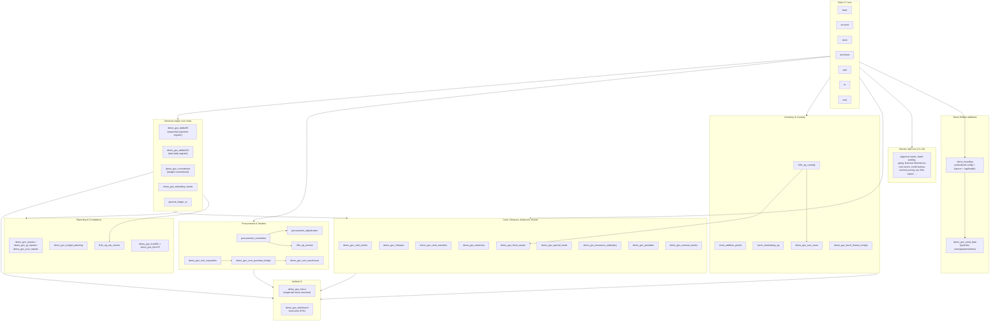

# Architecture

## Stack

| Layer | Technology |
|---|---|
| Application framework | Odoo 17 (Community) — Python 3, its own ORM, QWeb templating |
| Database | PostgreSQL 13+ |
| Backend language | Python 3 |
| Frontend | Odoo's own web client (OWL framework) + server-rendered QWeb reports (PDF via wkhtmltopdf/WeasyPrint) |
| Reporting | QWeb PDF reports (Arabic RTL, Amiri/Cairo/Noto fonts), one module (`demo_gov_reports`/`demo_gov_gl_reports`) overrides the PDF engine to WeasyPrint for two report types |
| Authentication | Odoo's built-in `res.users` (session-based); no external identity provider integrated |
| Authorization | Odoo `res.groups` + `ir.model.access.csv` + record rules, per module (see `ROLE_MATRIX.md`) |
| Background jobs | Odoo `ir.cron` (one scheduled job found: `l10n_eg_auction` auction closing cron) |
| External integrations | Egyptian Tax Authority e-invoicing (ETA) REST API; a configurable Credit Bureau REST API — see `INTEGRATIONS.md` |
| Deployment (production repo) | None present — no Dockerfile, CI/CD, or `odoo.conf` in the source tree; `odoo_deployment_ar/addons/install.sh` is a manual shell installer only |
| Deployment (Demo Edition) | Added: Dockerfile (official `odoo:17.0` base) + `docker-compose.demo.yml` (Odoo + Postgres) |

The repository ships **addons only** — it depends on an Odoo 17 core
checkout that is not part of this repo (see `demo_edition/README.md` for
how to obtain it).

## Module dependency structure (Demo Edition naming)

## Report layout convention

Most printed reports (`demo_gov_reports`, `demo_gov_fixed_assets`,
`demo_gov_daftar55`, etc.) share a single header/footer template
(`demo_gov_reports/reports/gov_shared_layout.xml`) rather than each
defining its own. That shared template is exactly where the anonymized
governorate seal and generic identity text live — see `BRANDING.md`.

## Notable design characteristics

- **State-machine-heavy custom models**: procurement adjudication,
  auctions, and Form 75 monthly closing all implement explicit workflow
  states (draft → ... → posted/awarded/closed) enforced in Python, not
  just UI hints. This is why transactional demo data was not scripted as
  raw XML (see `DEMO_DATA.md`) — it must go through the real transitions.
- **One shared PDF engine override** (`weasyprint_override.py`, present
  in `demo_gov_reports` and `demo_gov_gl_reports`) routes specific report
  names through WeasyPrint instead of Odoo's default wkhtmltopdf, for
  better Arabic shaping.
